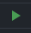
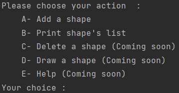

# README : DRAWER

#### made by : Malo Clément et Hugo Leyx-valade

*** 

* **INSTALATION :**

Télécharger le fichier _.zip_ contenant le projet.

* **UTILISATION :**

Pour lancer le projet éxécutez le simplement grace à la flèche verte :

Ainsi le **_main.c_** se lance et éxécute le programme principal.
Un menu s'affiche et vous propose de choisir entre plusieurs options :

Pour le moment seul les options A et B sont utilisables.

_A- Add a shape_ : Crée une shape et l'ajoute à la liste de toutes vos shapes.

_B- Pint shape's list_ : Affiche la liste de toutes les shapes.

